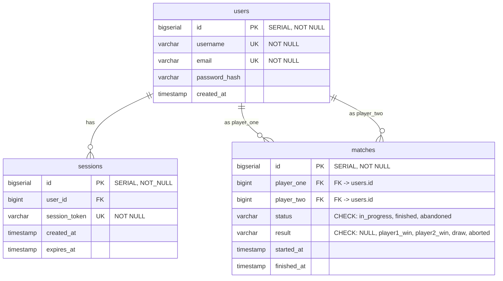
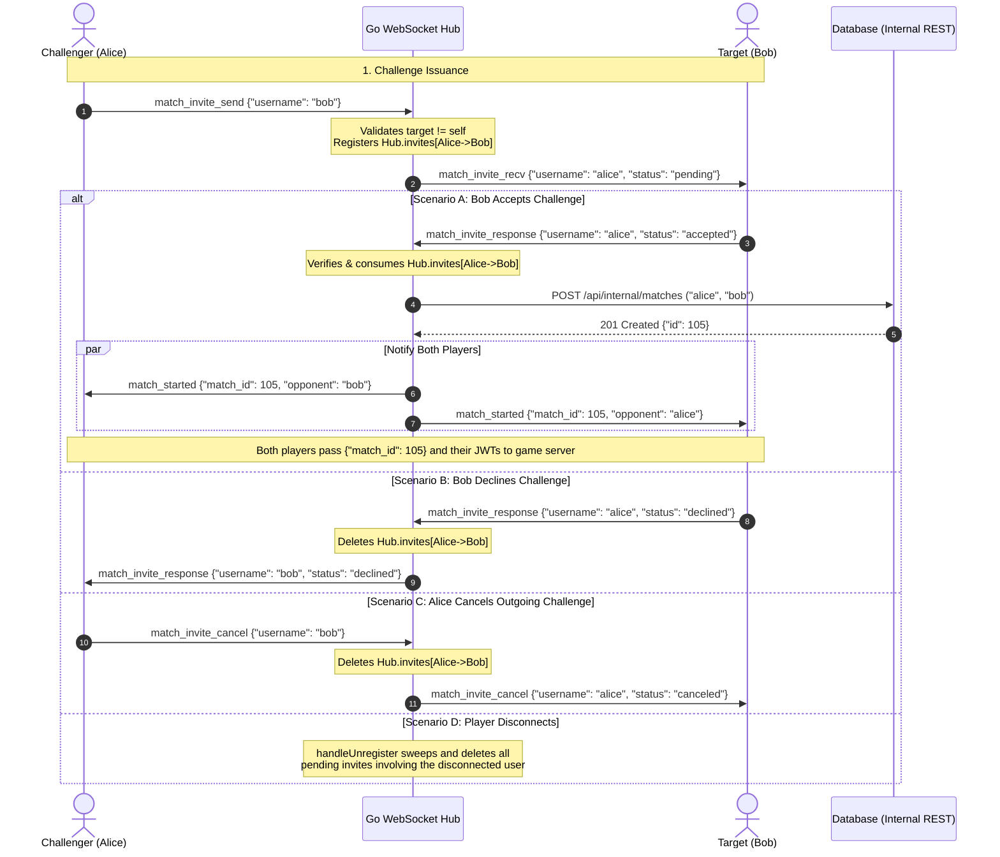

_This project has been created as part of the 42 curriculum by jpelline, anpollan, mhrvasm, zfarah and nraatika._

# Backend & Database

## Description

This repo hosts the **Go** Backend server, the **Postgres** Database server, and related infrastructure code

### Team Information

Lead developer for backend: Niklas Raatikainen
Contributions:

### Technical Stack

#### Docker

Docker is used to run separate services in isolated containers and networks, controlled by a Docker Compose file.

- at the front gate there is a **Caddy** container acting as a reverse proxy, listening for incoming HTTPS traffic on port 8443 (it also accepts incoming HTTP traffic on port 8000 only for upgrade-to-HTTPS purposes). Traffic to `/api/*` gets routed to the **Backend server**, which in turn connects to the **Database Server**.

#### Backend server

- The backend server is written in **Golang**, with the standard library `http.ServeMux` package doing the basic work of serving API endpoints
- We use some third-party packages in addition to the Go standard:
  - To facilitate the connection to the **Database Server** we use the **Bun ORM** package [\[Docs\]](https://bun.uptrace.dev/) / [\[GitHub\]](https://github.com/uptrace/bun)
  - For password hashing we use the **`crypto`** package [\[GitHub\]](https://github.com/x/crypto)
  - For input validation before passing things to the database we use the **`validator`** package [\[GitHub\]](https://go-playground/validator/v10)
  - To handle graceful use of `.env`-files we use the **`godotenv`** package [\[GitHub\]](https://go-playground/validator/v10)
  - To help with automated testing we use the **`testify`** package [\[GitHub\]](https://github.com/stretchr/testify)
  - To handle JWT creation and testing, we use a **`jwt`** package [\[GitHub\]](https://github.com/golang-jwt/jwt/v5)

##### Internal packages

To help keep the server maintainable, code is internally divided into a few packages:

- `main` sets up and starts the server
- `db` handles setting up the database connection, and running any needed migrations (setting up tables in the database, etc)
- `models` defines the translation of structs in Go to database tables in Postgres (you pass a struct defined in `models` as an argument to the Bun DB connection, and Bun uses that model to correctly translate that to SQL queries that get sent to the database)
- `handlers` package define handlers for each endpoint we're serving
- `internal/testutil` package contains helpers to testing functions
- `handlers_test` package contains tests to validate that the handlers are working correctly, including some integration tests with the DB
- `models_test` package contains tests to validate the models integrate correctly with the DB tables

#### Database Schema



##### TODO:

---

## Instructions

To test out, you must create a `secrets/` folder parallell to the root of the repo, and make a file called `postgres_user_pw.txt` containing the password used to connect to the DB, and run the commands to create private and public key files in that folder:

```
openssl genpkey -algorithm RSA -out jwt_private.pem -pkeyopt rsa_keygen_bits:2048
openssl rsa -pubout -in jwt_private.pem -out jwt_public.pem
```

You also need to generate a valid internal API key, 32 hexes represent enough randomness:

```
openssl rand -hex 32 > secrets/gameserver_api_key.txt
```

fill out `.env.example` into `.env`. You can then launch the backend and database containers with the command

```
docker compose up -d --build
```

which should result in:

- containers `database`, `caddy-test` and `go-server` launching
- the backend establishing a connection to the DB
- the backend creating the `users`, `sessions` and `matches` tables in the DB, as specified in `backend/db/migrations/`
- the backend registering handlers for endpoints
  - `/api/register`
  - `/api/login`
  - `/api/renew`
  - `/api/internal/matches`
  - `/api/internal/matches/{id}`
- the reverse proxy `caddy-test` exposing ports 8000 (HTTP) and 8443 (HTTPS), while backend and databse don't expose any ports to the host network

Functionality can be tested using Postman.

### Endpoints

#### Open endpoints

##### `POST /api/register`

The register endpoint is expecting a request with type `application/json`, as defined in `handlers/register.go`:

```
type RegisterRequest struct {
	Username string `json:"username" validate:"required,min=3,max=50,username_safety"`
	Password string `json:"password" validate:"required,min=8,max=72,password_complexity"`
	Email    string `json:"email" validate:"required,email,max=255"`
}
```

This means all fields are required, there are length constraints on all, the keys must be exactly as stated in the tag string, and username and password have additional constraints that are checked before trying to add a user to the database, named `username_safety`, and `password complexity`. These constraints, and JSON conformity, is checked by the `DecodeAndValidate` function, which is run before trying to add the new user to the DB, with any missed constraints passed back to the requester in the body of the `BadRequest` response.

If input passes validation, a password hash is generated using the `bcrypt` algorithm, which is what is stored in the database.

We use Bun ORM to try to insert the new user to the database, however both `username` and `email` fields have the unique constraint, so insertion may be expected to fail on duplicate input to an existing account for either field, and that error is returned to the requester as a `Conflict` response.
The following user-defined checks are done:

- `username_safety`
  - This checks that the username contains only alphanumerics, underscores and dashes
- `password complexity`
  - This checks that the password contains characters from at least two of the categories `[uppercase, lowercase, digit, special]`.

##### `POST /api/login`

The `login` endpoint expects a request with type `application/json`, as defined in `handlers/auth.go`:

```
type LoginRequest struct {
	Username string `json:"username" validate:"required,min=3,max=50"`
	Password string `json:"password" validate:"required,min=8,max=72"`
}
```

Here we only check the length constraints before trying to fetch user info with the given input, using `bcrypt` to check whether the given password matches the hashed one in the database if the user was found, and returns a response. If login is succesfull, a new entry is created into the `sessions` table in the DB, containing a unique, random 26-character string, that is returned to the caller as a secure, HttpOnly cookie with the name `session_id`. Cookie is valid 24 hours.

#### Cookie-protected route

This route requires a `session_id`-cookie to be attached to the request, or it's rejected. This is handled by a middleware that checks in the that the given session exists and is valid in the `sessions` table, and fetches the data of the `user` referred to in that entry, and attaches it to the request, so the handler doesn't need to do a separate request.

##### `POST /api/renew`

The `renew` endpoint issues a JWT signed with a private key using `RS256`, with the users' username and id as the payload, as well as the required fieds:

```
RegisteredClaims: jwt.RegisteredClaims{
			Issuer:    "dbBackend",
			Subject:   strconv.Itoa(int(user.ID)),
			IssuedAt:  jwt.NewNumericDate(now),
			NotBefore: jwt.NewNumericDate(now),
			ExpiresAt: jwt.NewNumericDate(now.Add(lifetime)),
		},
```

We use 60s as the lifetime currently.

#### API key protected routes: `/api/internal/*`

These routes are intended to be used by internal microservices (the **WebSocket service** and the **Game server**) when they need to get or store data in the database. This is accomplished by a middleware, that checks whether the request has a key provided in the header, and that it matches a known key

##### `POST /api/internal/matches`

Used by the **WebSocket service** to create a new match entry in the database when an opponent accepts a challenge. The expected request body, as defined in `models/match.go`:

```go
type MatchCreateInput struct {
	Player1 string `json:"player_one" validate:"required,min=3,max=50"`
	Player2 string `json:"player_two" validate:"required,min=3,max=50"`
}
```

So to create a match record, the player usernames are sent. The handler resolves both usernames to database IDs and the `status` field is set to "`in_progress`". If successful, the return is a JSON with the content

```json
{
  "id": <id>
}
```

This value can be later used to update the result of the match:

##### `PATCH /api/internal/matches/{id}`

Used to update a match with a result. The expected request body, as defined in `matches.go`:

```
type MatchPatchInput struct {
	Result string `json:"result" validate:"required,oneof=player1_win player2_win draw aborted"`
	Status string `json:"status" validate:"required,oneof=finished abandoned"`
}
```

This means that the "`result`" must be one of `player1_win`, `player2_win`, `draw` or `aborted`, and "`status`" must be one of `finished` and `abandoned`

To perform an update, we first filter the `matches` table to only include entries with the `id` specified in the request address, and only ones where status is `in_progress`. This means a match result can only be updated once, while trying to update an id that doesn't exist in the table or that doesn't have status `in_progress`, results in an error `http.StatusConflict` (409) being returned.

##### `GET /api/internal/friends/{id}`

Called by the **WebSocket service** on client connection and disconnection to fetch the user's friends list and determine which friends should receive real-time presence updates (`online_status`).

##### `POST /api/internal/messages`

Called by the **WebSocket service** to persist chat messages. Resolves the recipient username to a user ID and inserts the message into PostgreSQL.

#### JWT protected routes: `/api/protected/*`

These routes are protected by a JWT checking middleware, which will extract the userid from the token after validating the signature and expiration status. That id is passed on to the handlers in the request context.

##### `GET /api/protected/profile`

This returns the users own profile. Response is JSON, exact details TBD.

##### `PATCH /api/protected/profile`

This updates the users information with the selected updates. response is status code only.

##### `DELETE /api/protected/profile`

This deletes the users profile. response is status code only.

### Real-Time WebSocket Service (`/api/ws`)

The WebSocket service manages live player presence and peer-to-peer match invitations. Clients connect to `GET /api/ws?token=<jwt>`, where the connection is authenticated via JWT validation.

#### Architecture & Concurrency Model

- **Actor-Model Hub (`realtime/hub.go`):** Operates on a single-threaded event loop (`Hub.Run()`). It is the exclusive owner of connected client sockets and pending challenge state.
- **Lock-Free Concurrency (CSP):** Client read goroutines (`readPump`) do not mutate shared state directly; they pass action messages via Go channels (`unicast`, `matchAction`, `register`, `unregister`). The `select` in `Hub.Run()` implements a **C**ommunicating **S**equential **P**rocesses architecture, that allows thread-safe operations affecting shared resources such as the clients map without explicit mutexes.
- **Microservice Decoupling (`realtime/datastore.go`):** The WebSocket service interacts with the database exclusively through the `DataStore` interface (`HttpDataStore`), which calls the `/api/internal/*` REST endpoints using `X-API-Key`.
- **Table-Driven Routing (`realtime/client.go`):** Dispatches incoming event frames using a typed `messageRoutes` table and generic `bind[T]` adapter.

#### Envelope Protocol

All WebSocket frames use a unified JSON envelope:

```json
{
  "type": "<message_type>",
  "payload": { ... }
}
```

---

#### Match Challenge Lifecycle

The challenge system coordinates invitations between two online players before launching an online game room.

##### State Machine Diagram



##### Security & State Invariants

1. **Anti-Spoofing / Unsolicited Acceptance Protection:**
   A player cannot force another player into a match by sending an unprompted `match_invite_response` (`accepted`). The Hub verifies that an active challenge from that challenger to that responder exists in memory. If not found, the response is discarded.
2. **Single-Use Consumption:**
   When an invite is accepted, it is immediately consumed and deleted from memory before match creation begins, preventing replay attacks or duplicate match creation.
3. **Disconnect Sweeping:**
   If either player disconnects while an invite is pending, `handleUnregister` automatically sweeps and deletes all active invites involving that user.
4. **Self-Challenge Prevention:**
   Players cannot challenge themselves.

##### Event Payloads Reference

| Direction                   | Type                    | Payload Example                               | Description                            |
| :-------------------------- | :---------------------- | :-------------------------------------------- | :------------------------------------- |
| Client $\rightarrow$ Server | `match_invite_send`     | `{"username": "bob"}`                         | Alice challenges Bob                   |
| Server $\rightarrow$ Client | `match_invite_recv`     | `{"username": "alice", "status": "pending"}`  | Bob receives Alice's challenge         |
| Client $\rightarrow$ Server | `match_invite_response` | `{"username": "alice", "status": "accepted"}` | Bob accepts Alice's challenge          |
| Client $\rightarrow$ Server | `match_invite_response` | `{"username": "alice", "status": "declined"}` | Bob declines Alice's challenge         |
| Server $\rightarrow$ Client | `match_invite_response` | `{"username": "bob", "status": "declined"}`   | Alice is notified Bob declined         |
| Client $\rightarrow$ Server | `match_invite_cancel`   | `{"username": "bob"}`                         | Alice cancels her pending challenge    |
| Server $\rightarrow$ Client | `match_invite_cancel`   | `{"username": "alice", "status": "canceled"}` | Bob is notified challenge was canceled |
| Server $\rightarrow$ Both   | `match_started`         | `{"match_id": 105, "opponent": "bob"}`        | Game start notification with match ID  |

### Testing

Testing can be run from the terminal:

```
`./backend/scripts/run_tests.sh`
```

It spins up the db container, exposing the DB_PORT on localhost to grant local access to the db for testing (via `docker-compose.override.yml`), runs the tests defined in the various `*_test.go`-files, and brings the db container back down.

---

## Resources

list of used resources
